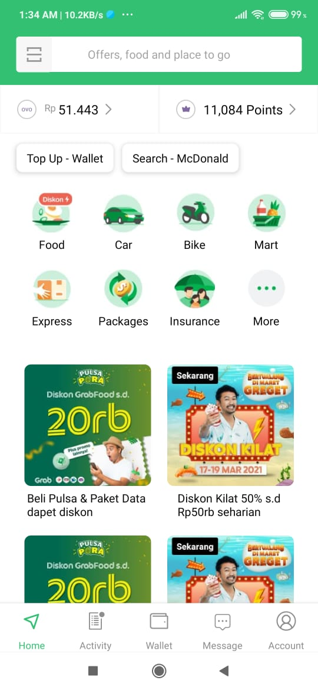

# Grab UI Clone

Hi! It's my project **grab-ui-clone** for client. it's only small project to cloning some of grab pages



## How to run this project

```bash
cd project
yarn install or npm install

yarn android
```

that's how you need to run this
